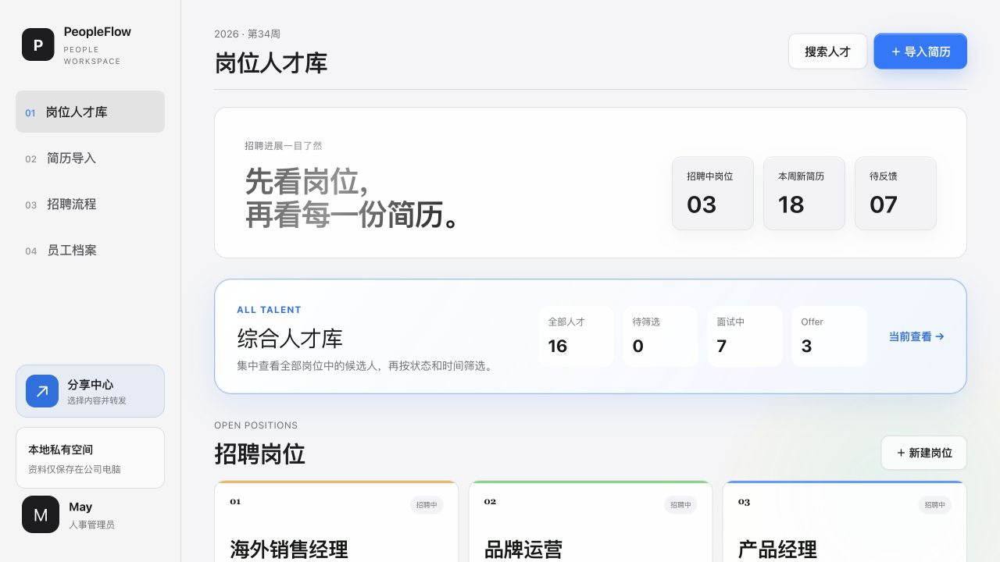
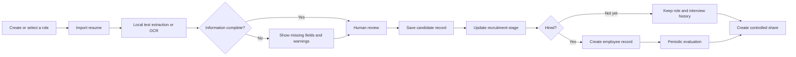
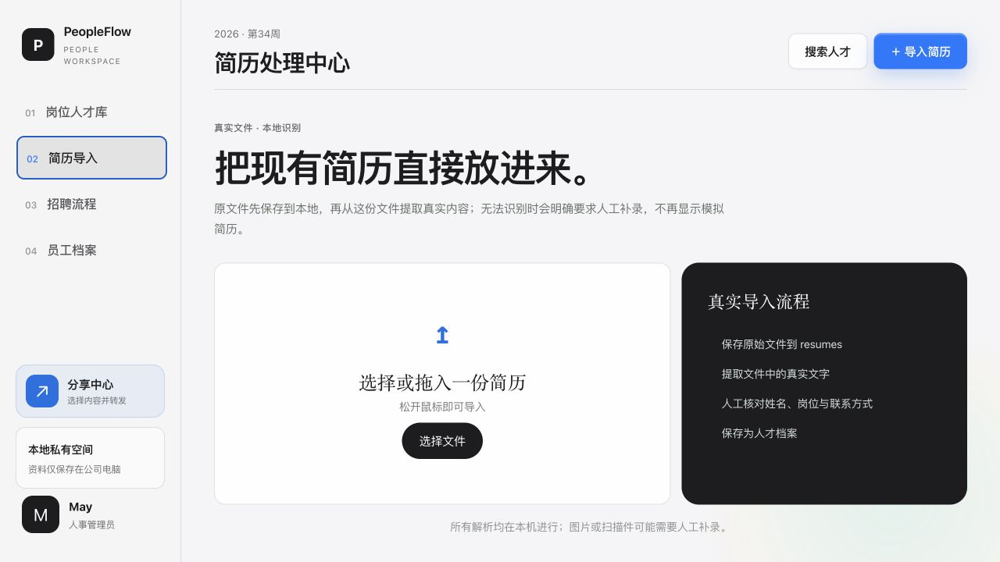
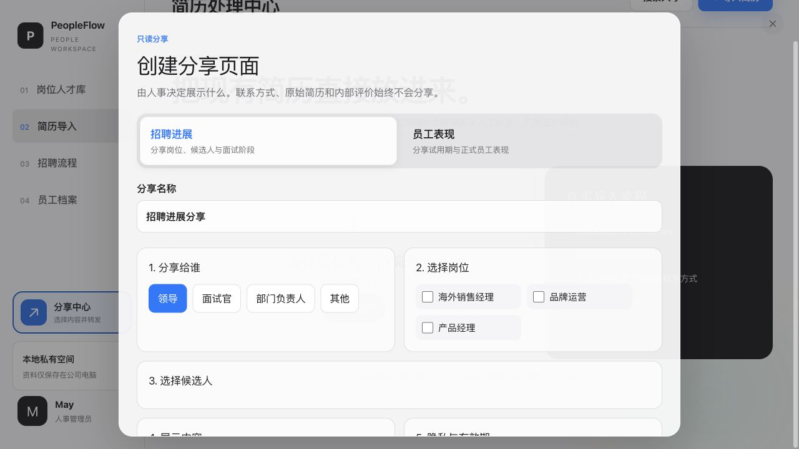

# PeopleFlow Workspace

### Designing a privacy-aware HR workflow from resume intake to controlled collaboration

PeopleFlow is a local-first HR workspace for small and mid-sized teams. It brings resume intake, human review, candidate pipelines, employee records, and selective sharing into one continuous workflow—without treating sensitive people data as ordinary cloud content.

**Independent product and prototype · ToB SaaS · HR Workflow · Human-in-the-loop UX · Local-first**

> This repository contains fictional demonstration data only. PeopleFlow is a working prototype and reusable template, not a security-audited production HR system.



## 01 Overview

Recruiting information often arrives through disconnected resumes, spreadsheets, chat messages, and interview notes. PeopleFlow explores how a small HR team could turn those fragments into a durable people record while keeping humans responsible for interpretation and decisions.

The prototype covers the workflow from opening a role to maintaining an employee record:

```text
Role and talent pool
→ Resume intake and local parsing
→ Human review and correction
→ Candidate stage and interview history
→ Candidate-to-employee transition
→ Controlled sharing and feedback
```

## 02 Problem

The project started with four connected problems:

- Candidate information is scattered across files, spreadsheets, and conversations.
- Resume parsing can accelerate entry, but extracted fields are not reliable enough to accept without review.
- Recruitment history is easily lost when a person is evaluated for more than one role.
- Hiring managers need visibility, but should not automatically receive contact details, original resumes, or internal HR notes.

The design question was not simply *how to build an HR dashboard*. It was:

> How might we reduce repetitive HR administration while keeping sensitive data, ambiguous information, and hiring decisions under human control?

## 03 Users

| User | Primary need |
| --- | --- |
| HR administrator | Import and maintain candidate and employee records efficiently |
| Hiring manager | Understand role progress and review selected candidates |
| Interviewer | See relevant context and return structured feedback |
| Team lead | Review selected employee performance information without accessing the full HR workspace |

## 04 My Role

This is an independently designed and implemented product prototype. My work included:

- defining the product scope and information architecture;
- mapping recruitment, employee, and sharing workflows;
- designing page hierarchy, interaction states, and safeguards;
- creating the responsive interface and fictional demo dataset;
- using AI coding tools to accelerate implementation and iteration;
- validating builds, key interactions, and local data behavior.

I do not present this as a deployed enterprise HR product or as evidence of production-scale HR operations.

## 05 Constraints

### Sensitive information

Resumes and employee records contain personal data. The prototype therefore prioritizes local storage, explicit sharing choices, fictional public demo data, and clear security limitations.

### Imperfect extraction

PDF, Word, Excel, and image resumes have inconsistent structures. OCR and text extraction can produce missing or uncertain fields, so the workflow requires human verification instead of presenting parsed data as authoritative.

### Small-team reality

The product needed to work as a lightweight local tool before requiring cloud infrastructure. SQLite, a local attachment directory, and backup scripts form the default mode; Supabase and hosted adapters remain optional.

## 06 User Flow



## 07 Information Architecture

PeopleFlow separates four responsibilities instead of placing everything in one generic people table:

1. **Role talent pool** — recruitment is first viewed by open role, then by individual candidate.
2. **Resume processing** — source-file intake, extraction, warnings, verification, and saving.
3. **Recruitment workflow** — stage, interview history, notes, next action, and role matching history.
4. **Employee records** — post-hire identity, department, status, skills, and periodic evaluation.

Controlled sharing sits across these areas as a separate permission-conscious workflow.

## 08 Interaction Decisions

### Organize by role before resume

HR teams usually act on open positions, not on an undifferentiated list of files. The landing view therefore shows role-level progress before exposing individual records.

### Preserve history instead of overwriting it

A candidate can be considered for multiple roles over time. Each match and decision is stored as a separate event so the latest status does not erase previous context.

### Make extraction uncertainty visible

Image resumes and scanned PDFs trigger OCR-specific warnings. Missing name, role, contact, experience, or education fields are surfaced for review before the record is accepted.



### Separate candidate and employee states

Hiring does not merely change a candidate tag. A deliberate transition creates an employee record with a different information model and evaluation lifecycle.

### Share a view, not the whole workspace

HR chooses the audience, roles or employees, visible sections, anonymization, and expiration period. Contact details, original resumes, and internal evaluations are excluded from recruitment shares.



## 09 AI-assisted Workflow

AI coding tools supported requirement decomposition, interface implementation, debugging, and iteration. The product itself currently uses local file parsing, OCR, rule-based field extraction, and explicit human review.

It should **not** be described as an autonomous AI hiring system. A future model-assisted version would still need confidence indicators, evidence references, correction controls, bias evaluation, access control, and auditability before influencing hiring decisions.

## 10 Prototype

The repository contains a working local prototype with:

- role-based and combined talent pools;
- search, filtering, labels, and recruitment stages;
- PDF, Word, spreadsheet, image, and OCR-assisted resume intake;
- missing-field warnings and human correction;
- interview and role-match history;
- candidate-to-employee transition and employee evaluations;
- selective, expiring, anonymized read-only shares;
- share records, feedback collection, and revocation;
- local SQLite storage, attachments, and backup scripts.

## 11 Outcome

The current outcome is a functional product prototype and reusable local-first template. It demonstrates how recruitment administration, people records, and stakeholder collaboration can be designed as one system without hiding uncertainty or privacy trade-offs.

No production adoption or conversion metrics are claimed. The next meaningful validation step would be task-based testing with HR users: resume intake, correcting an extraction error, moving a candidate through stages, converting a hire, and creating a privacy-limited share.

## 12 What I Learned

- Automation is most useful when the product also designs the correction path.
- Candidate and employee records are related, but their responsibilities and permissions are different.
- Sharing is not a secondary export feature; it is a product workflow with audience, scope, duration, and revocation.
- For sensitive internal tools, privacy and failure states shape the information architecture from the beginning.
- AI-assisted implementation is strongest when product decisions and acceptance criteria are explicit first.

---

## Run locally

Requirements: Node.js `>=22.13.0` and pnpm.

```bash
pnpm install
pnpm run build:local
pnpm run start:local
```

Open:

- Workspace: `http://localhost:3210/preview`
- Shared view: `http://localhost:3210/showcase`

Local data is written to `PeopleFlow-Data/` by default. The directory is ignored by Git and can be changed with `PEOPLEFLOW_DATA_DIR`.

### Useful commands

```bash
pnpm run build:local   # Build the local workspace
pnpm run start:local   # Start the local server
pnpm run package:local # Create a portable Windows package
pnpm run build         # Verify the Next.js build
pnpm run lint          # Run code-quality checks
pnpm test              # Build and run rendered HTML tests
```

## Privacy and security

PeopleFlow is not security-audited for production HR data. Before real deployment, add authentication and role authorization, isolate public and internal APIs, restrict attachment access, configure HTTPS and audit logs, define retention rules, and test backup recovery.

The local server may be reachable on the company network to support shared views. The deployer is responsible for protecting the workspace entry point and network environment.

## Technical foundation

- Next.js 16, React 19, TypeScript
- Node.js local HTTP service and SQLite
- Tesseract.js, PDF.js, OfficeParser, SheetJS
- Optional Supabase, Drizzle, Cloudflare, and Netlify adapters

## License

[MIT](LICENSE)
